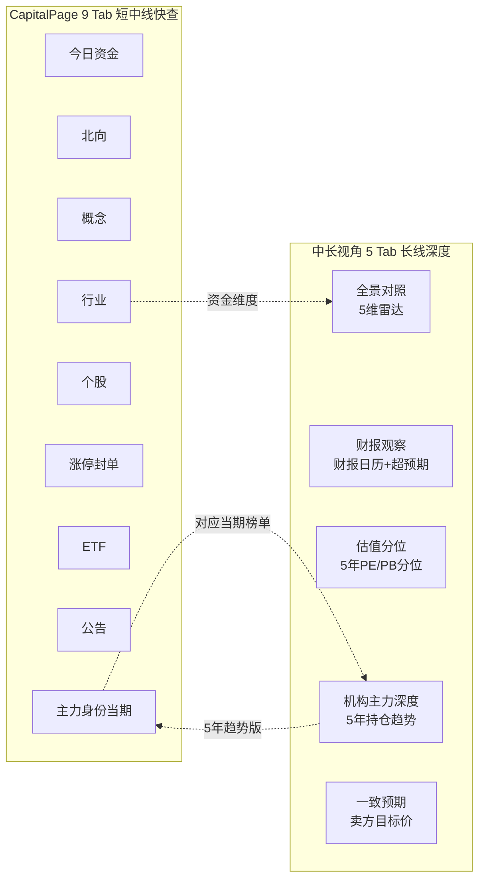
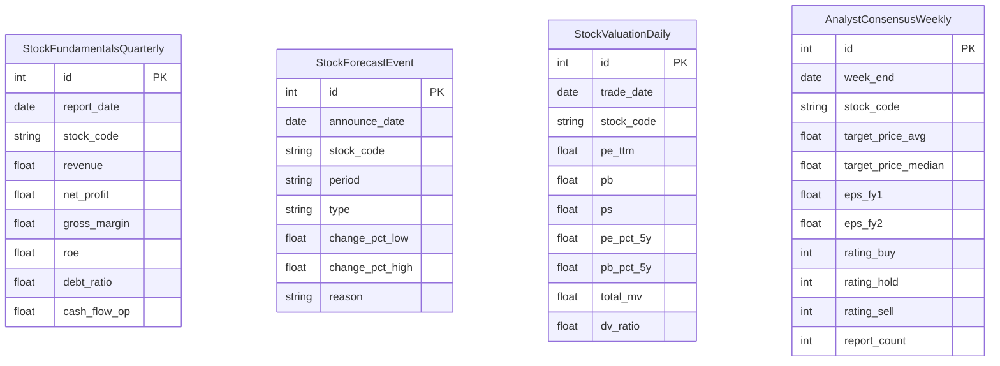

# 中长视角设计文档

> Phase 0 输出，作为 Phase 1-3 实施依据。

## 一、目标与定位

公开网站要同时服务三类用户，但不做 persona 切换、不做独立 workspace，采用 **「多视角并存」** 架构：

| 用户类型 | 关心维度 | 现有覆盖 | 新增覆盖 |
|---|---|---|---|
| 短线 / 打板 | 题材 / 涨停 / 龙虎榜 / 新闻 / 异动 | TodayReview / Sentiment / Themes / LHB / News | — |
| 波段 / 趋势 | 主力资金 / 北向 / 行业景气 / 周线形态 | CapitalPage 9 Tab + capital_brief | swing_brief 模块 |
| 长线 / 价投 | 财务质量 / 估值水位 / 一致预期 / 主力 5 年趋势 | institutional 已有当期 | **完整新增** |

「中长视角」**只服务后两类用户的长线需求**，**不与 CapitalPage 重复**。

## 二、与 CapitalPage 的边界



**判定原则**：

- 任何"今日 / 当期 / 5 日内"的数据 → CapitalPage
- 任何"5 年 / 趋势 / 分位 / 财务"的数据 → 中长视角
- 重叠点（机构主力）：CapitalPage 看当期榜单，中长视角看 5 年变化趋势 + AI 主力意图分析。CapitalPage `holders` Tab 末尾加跳转按钮 → 中长视角对应股票

## 三、5 个 Tab 详细设计

### Tab 1: 全景对照（默认 Tab）

- **顶部**：EntityPicker（全局股票/行业 picker），选定后所有 Tab 联动
- **主区**：5 维雷达图
  - 财务质量（来自 fundamentals：5 年 ROE 均值 + 净利率 + 现金流质量）
  - 估值水位（来自 valuation：PE 5 年分位反向 + PB 5 年分位反向）
  - 资金面（来自 capital：主力 + 北向 5 日累计 + ETF 申购）
  - 主力背书（来自 holder：汇金 / 社保 / 险资 / QFII 持仓个数 + 5 年加仓势头）
  - 景气位置（来自 industry + concept：所属行业涨跌排名 + 概念热度）
- **AI 一句话定调**：multi_perspective.long_term.headline
- **快捷跳转**：每个雷达维度点击 → 跳到对应 Tab 详情

### Tab 2: 财报观察

- **业绩预告日历**（左 1/3）：未来 30 天即将披露的股票，按当前持仓 / 自选股优先
- **超预期排行**（右 2/3）：最新一季业绩超预期 / 不及预期 Top 50
- **财报后异动复盘**：业绩超预期股票披露后 5 日 / 20 日涨跌幅
- **AI 财报点评**：单股选定后，AI 从 5 年财务给出 3 段（增长可持续性 / 利润质量 / 风险点）

### Tab 3: 估值分位

- **PE/PB 5 年分位热力图**：全市场 / 行业 / 自选股三个视角
- **行业估值对比**：按申万一级行业，PE 与 5 年中位数偏离度
- **自选股估值监控**：用户自选股的 PE/PB 历史百分位
- **付费墙**：未付费看 1 年分位，付费看 5 年

### Tab 4: 机构主力深度（区别于 CapitalPage.holders）

- **5 年持仓趋势**：单股选定后，汇金 / 社保 / 险资 / QFII / 公募 5 年持股股数 + 占流通股比折线
- **加减仓时间线**：每季报标记 new / add / cut / exit 事件
- **AI 主力意图**：基于 5 年加减仓节奏 + 当下事件（公告增减持），AI 推断主力意图
- **跨股对比**：选 2-3 只股票对比同一主力（如汇金）的持仓变化

### Tab 5: 一致预期

- **卖方目标价分布**：箱线图 + 报告数热度
- **EPS 预期上修 / 下修排行**：近 30 天 EPS 一致预期变化
- **评级热度**：买入 / 增持 / 中性 / 减持比例

## 四、数据源与表结构



## 五、tushare 接口与积分需求

### 已用接口（不重复采购）

`daily` / `daily_basic`（仅 turnover_rate） / `limit_list_d` / `kpl_list` / `kpl_concept` / `kpl_concept_cons` / `dc_index` / `dc_member` / `top_list` / `top_inst` / `stock_basic` / `trade_cal`

### 新增接口积分要求

| 接口 | 用途 | 积分门槛 | 频次 |
|---|---|---|---|
| `fina_indicator` | 财务指标（ROE/毛利率/现金流） | 5000 | 季度（约 1 次/月） |
| `forecast` | 业绩预告 | 2000 | 每周一次扫全市场 |
| `express` | 业绩快报 | 2000 | 每周一次 |
| `daily_basic` 全字段 | PE/PB/PS/total_mv（现仅取 turnover_rate） | 2000 | 每日（pipeline 之后） |
| `report_rc` | 卖方研报一致预期 | 2000 | 每周一次 |
| `fina_mainbz` | 主营业务构成（可选，二期） | 5000 | 季度 |

**当前 token 5000+ 积分已覆盖前 5 个**，`fina_mainbz` 二期再说。

## 六、历史回填范围决策

| 表 | 周期 | 回填范围 | 总行数 | 接口调用次数 | 限速 200 次/分钟下完成时间 |
|---|---|---|---|---|---|
| StockFundamentalsQuarterly | 季 | 5 年（20 季） | 20 × 5300 ≈ 10.6 万 | 5300（按股拉） | 27 分钟（一次跑完） |
| StockForecastEvent | 事件触发 | 5 年 | 估算 5 万 | 5300（按股拉） | 27 分钟 |
| StockValuationDaily | 日 | 5 年（约 1200 交易日） | 1200 × 5300 ≈ 636 万 | 1200（按日拉，每次全市场） | 6 分钟 |
| AnalystConsensusWeekly | 周 | 1 年（52 周） | 52 × 5300 ≈ 27.5 万 | 5300（按股拉） | 27 分钟 |

**回填策略**：

- 估值表（最大）按日反向回填，**1200 次调用 ≈ 6 分钟**（最快），优先做完
- 财务 / 一致预期按股拉，可分天跑（每天回 30 个交易日的 270 股 ≈ 8000 次调用）
- 部署夜间任务（22:00-04:00）执行回填，**约 1 周完成**

## 七、AI 多视角缓存策略

| 视角 | 缓存 TTL | 预热时机 | 复杂度 |
|---|---|---|---|
| short_term | 1-15 分钟 | 盘中分钟级（已有 prewarm-news-brief 模式） | 低（题材+异动） |
| swing | 24 小时 | 盘后 16:30 | 中（capital + 周线形态） |
| long_term | 7 天 | 每周一 18:30 | 高（财务+估值+一致预期 5 年） |

**单次 LLM 出三段的 prompt**（multi_perspective.py 实现要点）：

```
SYSTEM: 你是 A 股多视角分析师。给定股票 7 维上下文 + 财务 + 估值 + 一致预期，
        必须严格输出 JSON，包含三段：short_term / swing / long_term。

USER: <股票代码 + 上下文 JSON>

OUTPUT SCHEMA:
{
  "short_term": {
    "headline": "≤30字 一句话",
    "stance": "看多|看空|观望",
    "evidence": ["..."],
    "ttl_minutes": 15
  },
  "swing": { ...同结构, ttl_hours: 24 },
  "long_term": { ...同结构, ttl_days: 7 }
}
```

## 八、商业化分层

| 功能 | 匿名 | 免费登录 | 付费 PRO |
|---|---|---|---|
| 全景对照 雷达图 | ✓ | ✓ | ✓ |
| 财报观察 列表 + 单股 AI 点评 | ✓ | ✓ | ✓ |
| 估值分位（1 年回看） | ✓ | ✓ | ✓ |
| 估值分位（5 年回看） | ✗ | ✗ | ✓ |
| 机构主力深度（1 年） | ✓ | ✓ | ✓ |
| 机构主力深度（5 年趋势） | ✗ | ✗ | ✓ |
| 一致预期（基础） | ✓ | ✓ | ✓ |
| AI long_term brief refresh | ✗ | 5 次/日 | 不限 |
| EntityPicker 全市场任选 | 限 100 股热门 | ✓ | ✓ |

## 九、实施次序

按照 plan 的 Phase 1-3 顺序：

1. **Phase 1**：建表 + tushare adapter + ingest 任务 + 历史回填（约 1 周完成回填）
2. **Phase 2**：multi_perspective.py + long_term_brief + swing_brief
3. **Phase 3**：MidLongViewPage 5 Tab + EntityPicker + api/midlong.py + 个股 Drawer 三视角
